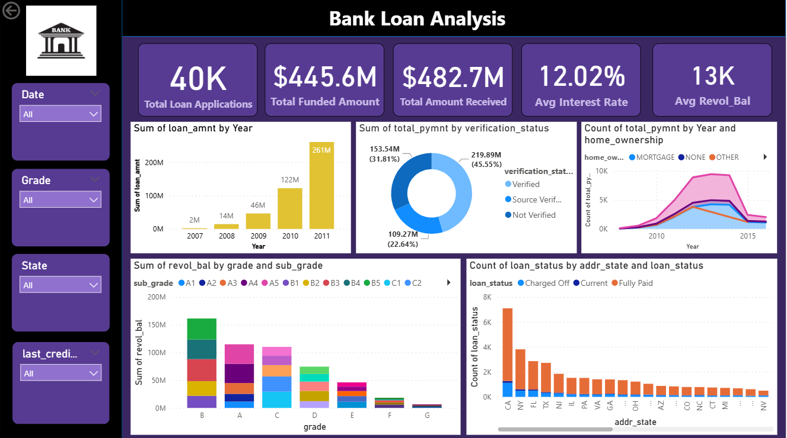
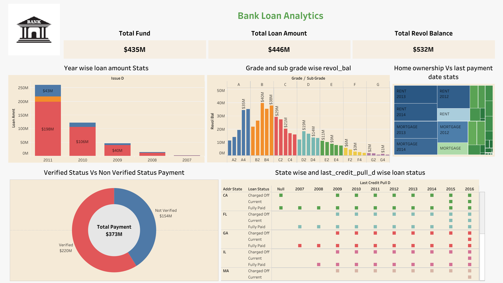

# Bank-Loan-Analytics
Bank Loan Analytics using SQL, Power BI &amp; Tableau

# 📊 Bank Loan Analytics – KPI Driven Dashboard Case Study

## 🔍 Project Overview
This project analyzes **39K+ bank loan records** to uncover insights related to **loan trends, credit risk, customer behavior, and repayment patterns**.

The analysis is performed using **SQL, Power BI, and Tableau**, simulating a real-world Business Analyst scenario where data is transformed into actionable business decisions.

---

## 🎯 Business Problem
Financial institutions need to balance **loan growth with risk management**.  
Without proper analysis, it becomes difficult to:
- Identify high-risk customers  
- Understand repayment behavior  
- Optimize lending strategies  

👉 **Goal:** Use data analytics to improve loan decisions and reduce default risk.

---

## 🛠️ Tools & Technologies
- **SQL (MySQL)** – Data extraction & KPI calculation  
- **Power BI** – Dashboard development & KPI tracking  
- **Tableau** – Exploratory data analysis  
- **Excel** – Data cleaning & validation  

---

## 📊 Dashboard Overview

This project includes an interactive **Power BI dashboard** that provides a complete view of the loan portfolio:

- KPI tracking (loan amount, payments, interest rate)  
- Loan trends over time  
- Credit risk segmentation  
- Customer behavior analysis  
- Geographic performance  

### 🔷 Power BI Dashboard

### 🔶 Tableau Dashboard

---

## 📈 Key KPIs & Analysis

### 1️⃣ Year-wise Loan Amount Stats
- Loan amount increased significantly from **2007–2011**  
- Peak observed in **2011**, indicating growth in lending  
- Highlights expansion in loan disbursement  

---

### 2️⃣ Grade & Sub-grade wise Revolving Balance
- Higher grades (A/B) → Lower risk  
- Lower grades (C–G) → Higher revolving balances  
- Sub-grade analysis reveals deeper risk segmentation  

---

### 3️⃣ Verified vs Non-Verified Payments
- Verified customers contribute **majority of total payments**  
- Non-verified customers show **higher default risk**  
- Emphasizes importance of verification  

---

### 4️⃣ State-wise & Credit Pull Date-wise Loan Status
- Loan performance varies across different states  
- States with higher approvals show better repayment trends  
- Recent credit pull dates are associated with improved loan status  
- Indicates importance of continuous credit monitoring  

---

### 5️⃣ Home Ownership vs Last Payment Date
- Renters show **stable repayment patterns**  
- Homeowners tend to take **larger loan amounts**  
- Useful for customer segmentation  

---

## 🧩 SQL Analysis
Used SQL to extract KPIs such as:
- Year-wise loan trends  
- Payment behavior by verification status  
- Risk segmentation by grade  

---

## 🧠 Key Insights
- Strong growth in loan disbursement over time  
- Risk concentrated in lower credit grades  
- Verified users demonstrate better repayment behavior  
- Geographic and behavioral factors influence loan performance  

---

## 💡 Business Recommendations
- ✔️ Prioritize **verified customers** during loan approval  
- ✔️ Monitor **low-grade borrowers** closely  
- ✔️ Expand in **high-performing regions**  
- ✔️ Offer **customer-segment-based financial products**  

---

## 📊 Business Impact
- 📉 Reduced default risk  
- 🎯 Improved loan approval accuracy  
- 💰 Increased profitability  
- 📍 Better regional and customer targeting  

---

## 🗂️ Project Structure
